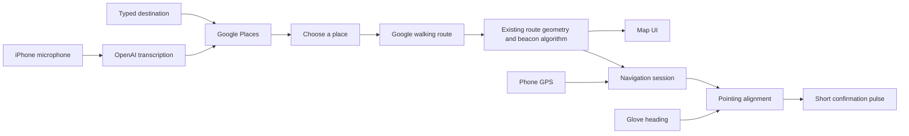

# How the app works

The default build currently runs a simulated voice-to-route preview. The flow below describes the intended live experience; see [the project plan](PROJECT_PLAN.md) for implementation status and integration gaps.

## User flow

1. Open Point to a white glove outline with one microphone control on its back.
2. Tap, say “take me to Shake Shack,” and tap to finish. A short recording is sent to OpenAI for transcription; the UI shows recording and searching states distinctly.
3. Search Google Places near the phone's location. Show the transcript, matching place names and addresses. The user chooses the intended place; no first-result auto-navigation.
4. The glove control becomes the origin of a clean map reveal. Preview the route and press Start walking.
5. Phone GPS advances the active route beacon. Glove orientation supplies the pointing heading. Vibration confirms when pointing at that beacon.
6. Pause or end the session. Future BLE integration supplies actual heading, gesture and battery events.

Typing is a first-class alternative. No-results, denied microphone access, missing GPS, unavailable services, and disconnected glove states stay visible. A separate sample-walk action previews the UI without credentials; it is labeled throughout.

## Architecture

The reusable core is Swift. UI composition is SwiftUI, with a UIKit bridge for Google's map, and an Apple map fallback for credential-free UI review. Network clients have injectable URLSession/credentials and sit behind small protocols. Runtime provider credentials are currently for local Debug development only. An authenticated backend is still needed for distribution; no account system or database has been added to the prototype.

## Deliberately small first version

One voice interaction, one place-selection sheet, one map view, one pointing signal. No tab bar, dashboard, settings maze, social system, camera UI, or multi-agent assistant. Common “take me to / navigate to” phrases are stripped before place search. This is single-turn voice search, not an implemented open-ended conversational agent. Add clarification dialogue only if real usage calls for it.

## Technical decisions

- Use a world bearing to the next geographic beacon, not a bearing to the final destination across all turns.
- Both route and glove headings must use the same true-north frame. An arbitrary IMU yaw or phone orientation cannot substitute for this.
- Confirmation enters after a brief stable alignment window; it stops for stale location/orientation, loss of connection, pause, reroute, or arrival. Exact thresholds and motor strength are provisional.
- Keep route progression independent of speech completion. Rerouting resets beacon indexing and discards stale asynchronous results.
- Preserve original route vertices while resampling, so corners do not vanish between evenly spaced checkpoints.
- Treat poor GPS as uncertain, rather than automatically advancing a beacon.

## Remaining integration

1. Configure provider access and test actual voice → place → route on an iPhone.
2. Replace `SimulatedGlove` with CoreBluetooth once firmware UUIDs and payloads are agreed.
3. Test glove-to-north calibration, placement, magnetometer interference, and physical vibration comfort.
4. Connect ongoing session state to the map and production device status, and exercise rerouting outdoors.
5. Add the authenticated provider proxy and validate background/locked-phone behavior before distribution.

The current UI demo's direction toggle previews alignment, not measured sensor data. The Swift command-line demo runs the actual core feedback calculation.

## References checked

- [OpenAI file transcription](https://developers.openai.com/api/docs/guides/speech-to-text): completed M4A recordings can be uploaded for a transcript.
- [Google Places Text Search](https://developers.google.com/maps/documentation/places/web-service/text-search): text query, location bias, explicit response fields.
- [Google Routes migration](https://developers.google.com/maps/documentation/routes/migrate-routes): current Routes responses differ from legacy Directions; normalize steps before using the old segmenter.
- [Apple Core Bluetooth background behavior](https://developer.apple.com/library/archive/documentation/NetworkingInternetWeb/Conceptual/CoreBluetooth_concepts/CoreBluetoothBackgroundProcessingForIOSApps/PerformingTasksWhileYourAppIsInTheBackground.html): background events do not imply unlimited continuous app execution. This version does not claim locked-screen operation is complete.
- [Apple fluid UI transitions](https://developer.apple.com/videos/play/wwdc2024/10145/): retain a recognizable source control across the transition; honor interruptions and Reduce Motion.
