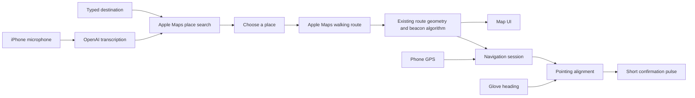

# How the app works

The default build currently runs a simulated voice-to-route preview. The flow below describes the intended live experience; see [the project plan](PROJECT_PLAN.md) for implementation status and integration gaps.

## User flow

1. Open Point to a white glove outline with one microphone control on its back.
2. Tap, say “take me to Shake Shack,” and tap to finish. Words appear on screen as they are spoken (Apple Speech on the phone). The recording is then sent to OpenAI for the final transcript when a key is configured; otherwise the on-device text is used.
3. Search Apple Maps near the phone's location. An unambiguous request routes straight away: a chain or generic name goes to the nearest match, and a qualified request (“the McDonald's on Mass Ave”, a street number) uses Apple's top result. Only ambiguous results show a chooser with names and addresses. The route screen always names the chosen place and offers Change destination.
4. The glove control becomes the origin of a clean map reveal. Preview the route and press Start walking.
5. Phone GPS advances the active route beacon. Glove orientation supplies the pointing heading. Vibration confirms when pointing at that beacon.
6. Pause or end the session. Future BLE integration supplies actual heading, gesture and battery events.

Typing is a first-class alternative. No-results, denied microphone access, missing GPS, unavailable services, and disconnected glove states stay visible. A separate sample-walk action previews the UI without credentials; it is labeled throughout.

## Architecture

The reusable core is Swift. SwiftUI and MapKit render both sample and live routes. `AppleMapsService` uses `MKLocalSearch` and `MKDirections`, then passes decoded step coordinates into the existing route segmenter and beacon extractor. Maps need no API key or custom backend. OpenAI transcription still uses a Debug-only development credential; distribution requires an authenticated voice backend. No account system or database has been added. Typed search already uses MapKit independently of the simulated microphone flow.

## Deliberately small first version

One voice interaction, one place-selection sheet, one map view, one pointing signal. No tab bar, dashboard, settings maze, social system, camera UI, or multi-agent assistant. Common “take me to / navigate to” phrases are stripped before place search. This is single-turn voice search, not an implemented open-ended conversational agent. Add clarification dialogue only if real usage calls for it.

## Technical decisions

- Use a world bearing to the next geographic beacon, not a bearing to the final destination across all turns.
- Both route and glove headings must use the same true-north frame. An arbitrary IMU yaw or phone orientation cannot substitute for this.
- Confirmation enters after a brief stable alignment window; it stops for stale location/orientation, loss of connection, pause, reroute, or arrival. Exact thresholds and motor strength are provisional.
- Keep route progression independent of speech completion. Rerouting resets beacon indexing and discards stale asynchronous results.
- Preserve original route vertices while resampling, so corners do not vanish between evenly spaced checkpoints.
- Treat poor GPS as uncertain, rather than automatically advancing a beacon.

## Remaining integration

1. Test typed Apple Maps search → selected place → walking route on an iPhone; configure OpenAI separately for live voice.
2. Replace `SimulatedGlove` with CoreBluetooth once firmware UUIDs and payloads are agreed.
3. Test glove-to-north calibration, placement, magnetometer interference, and physical vibration comfort.
4. Connect ongoing session state to the map and production device status, and exercise rerouting outdoors.
5. Add the authenticated voice proxy and validate background/locked-phone behavior before distribution.

The current UI demo's direction toggle previews alignment, not measured sensor data. The Swift command-line demo runs the actual core feedback calculation.

## References checked

- [OpenAI file transcription](https://developers.openai.com/api/docs/guides/speech-to-text): completed M4A recordings can be uploaded for a transcript.
- [Apple place search](https://developer.apple.com/documentation/mapkit/mklocalsearch): native text search with a nearby search region.
- [Apple walking directions](https://developer.apple.com/documentation/mapkit/mkdirections): walking route steps and polylines feed the existing beacon algorithm.
- [Apple Core Bluetooth background behavior](https://developer.apple.com/library/archive/documentation/NetworkingInternetWeb/Conceptual/CoreBluetooth_concepts/CoreBluetoothBackgroundProcessingForIOSApps/PerformingTasksWhileYourAppIsInTheBackground.html): background events do not imply unlimited continuous app execution. This version does not claim locked-screen operation is complete.
- [Apple fluid UI transitions](https://developer.apple.com/videos/play/wwdc2024/10145/): retain a recognizable source control across the transition; honor interruptions and Reduce Motion.
