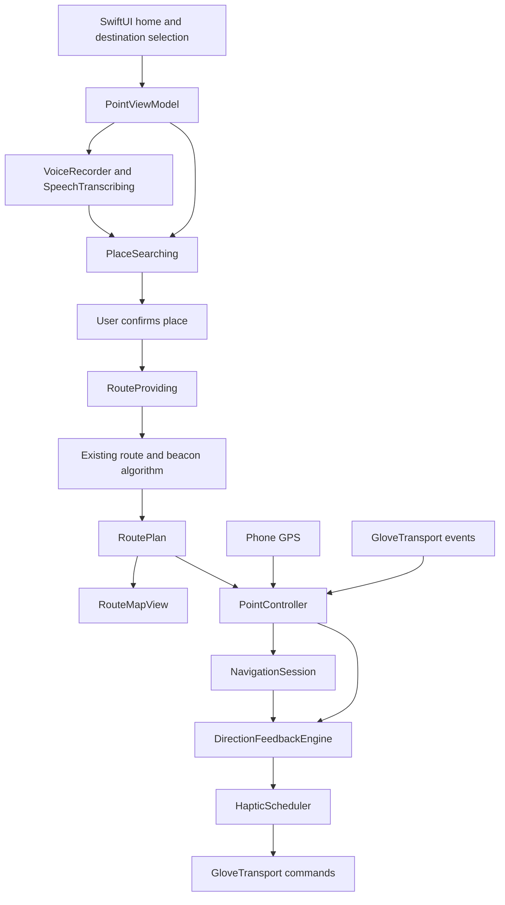

# Point — project plan and team handoff

Updated: September 19, 2026 — Apple Maps migration. This document separates code that exists today from integration work and future design work.

Phone test update: the phone can stand in for the glove with a fixed screen-down/top-edge-forward grip and eased vibration. Apple Maps guidance now has full strength across ±10°, then fades smoothly to zero at ±35°. Outdoor route testing uses GPS/true-north compass; **Test beacons** uses optional ARKit camera placement for 0.5–8 m local tests. Active-target highlighting, phone pause/resume, arrival/status UI and a 20 Hz stale-data loop are wired. Started walking sessions retain GPS progress on inactivity through background location; phone vibration stops until foregrounded. Local AR beacons clear on interruption. A cyan map arrow shows fresh physical top-edge heading, and Test vibration checks the motor independently. Real Apple Maps routes now show beacon progress and play two pulses per confirmed intermediate arrival, then guide toward the next target; three pulses mark the destination. A multi-beacon integration test verifies GPS progression and changed pointing targets. Playback now reuses one finite-pattern player across guidance and cues, with automatic recovery from startup/player failures and engine interruptions. Hardware work runs on a dedicated serial queue with only the latest pending command; the UI/sensor loop never waits for engine startup. GPS status distinguishes stale data from nearby-beacon uncertainty, and a recent good fix survives one poor update only until its existing five-second expiry. Repeated-use recovery is covered with an injected output adapter; physical-device verification remains pending. See [phone beacon test instructions and tuning](PHONE_BEACON_TEST.md).

Voice update: the live Apple Speech/OpenAI input flow now has Deepgram Flux spoken replies, with native speech fallback. `.env.example` documents Debug-only configuration. Speech stops on recording, cancel, inactivity and interruption; VoiceOver owns announcements when enabled. See [voice setup](VOICE_SETUP.md). City clarification, route confirmation and follow-up corrections are implemented; unrestricted conversation remains out of scope.

Maps update: map display, destination search, and walking directions now use native Apple MapKit. The Google SDK and key requirements have been removed. Typed destination search needs no API credentials. The microphone now records and transcribes through OpenAI in Debug builds; the scripted demo runs only with the `--preview-route` launch argument.

Bluetooth update: the merged ESP32-C6 echo firmware now has a matching iOS device setup flow. Users can scan, connect, and verify a unique command/status round trip. This remains separate from navigation capabilities, which the firmware does not yet implement. See [device setup](DEVICE_SETUP.md) for the bench test; live board verification is pending.

## 1. Product and agreed scope

Point is a camera-free walking-navigation app paired with a pointing glove. The user says where they want to go, confirms the destination, and points their hand toward the next geographic route beacon. A short vibration confirms correct pointing.

The app is for anyone, with an intended focus on people with visual impairments. Voice input, accessible controls, understandable connection states, and nonvisual feedback matter more than a dense dashboard. The prototype is not yet validated as an independent mobility aid.

Decisions already made:

- Native Swift and SwiftUI on iPhone, with a reusable Swift navigation core.
- Phone GPS supplies position; the glove supplies its own pointing orientation over Bluetooth Low Energy.
- We are using the existing algorithm for route geometry, checkpoints, and geographic beacons. The surrounding app, map presentation, voice flow, session control, and glove feedback are being built around it.
- Vibration means the glove is pointing toward the active beacon. It does not encode left/right turns, walking direction, or obstacle clearance.
- No camera is required for walking navigation or glove hardware. An optional phone-only ARKit test screen uses the camera to place nearby temporary beacons.
- Keep the home screen minimal: wordmark, short prompt, hand, microphone, typing alternative, and preview.
- Hardware selection and assembly belong to the hardware team. The app communicates through a replaceable transport interface.

Earlier brainstorming covered rehabilitation, learned gestures, a belt attachment, cycling, and multiple sponsor integrations. The agreed implementation is the navigation glove described here. Those other ideas are not current app features.

## 2. What partners can run today

The default app records real speech, with live Apple Speech text and optional OpenAI final transcription. Typing works without provider keys. For the staged animation demo, launch with `--preview-route`:

1. The selected sketch hand pinches and pulls in a native transcript banner.
2. “Take me to Shake Shack” appears word by word.
3. A short loading state represents route preparation.
4. A circular map reveal expands from the voice control.
5. A synthetic Cambridge route appears with a destination panel.
6. “Try the walk” exposes a simulated pointing toggle. This previews UI and phone haptics; it is not glove telemetry.

The staged preview makes no transcription, place-search, or routing requests. Map tiles and an optional spoken sample-route announcement can still require a network connection. The sample route and store location are synthetic and must not be presented as verified walking directions.

Separately, `swift run point-demo` drives the real feedback engine with simulated location and heading samples and prints the resulting motor commands.

## 3. Implementation inventory

| Area | Present in the repository | Remaining work |
| --- | --- | --- |
| Home UI | Minimal dark SwiftUI screen; selected sketch hand; embedded microphone with an invisible native hit target; keyboard alternative | Validate small screens, VoiceOver, larger accessibility text, and physical-device playback |
| Background | Recognizable monochrome map, 2-point blur, drifting silver and muted gold light, soft sheen | Physical-device performance/battery review |
| Motion | Transparent hand-pull movie, native banner/transcript, loading glyph, eased map portal; Reduce Motion support | Physical-device decoder, power and timing checks |
| Voice capture | Permission handling, short M4A recording, finish/cancel, three-second observed silence, 60-second limit, temporary-file cleanup | Live account/device test; interruption and recovery validation |
| Transcription | Injectable OpenAI transcription client | Verify configured model and account access; implement authenticated backend for distribution |
| Spoken replies | Deepgram Flux TTS, native speech fallback, VoiceOver announcements, cancellation and audio interruption handling | Field-test spoken disambiguation, interruptions and timed captions; authenticated backend |
| Place search | Native Apple Maps text search with a nearby region, up to five candidates, explicit destination selection | Live service and simulator happy path verified; physical-iPhone and permission/no-results/error checks remain |
| Route fetch | Native Apple Maps walking directions; decoded steps feed the existing algorithm | Live service and simulator route display verified; outdoor comparison and service failure tests remain |
| Transit | Automatic offer (walks over ~10 min ask "T or walk?" by voice) and transit/walk phrases; `TransitPlanner` (MBTA patterns + Apple walks, transfers at rapid-transit stations, ≤ 4 MBTA calls); `JourneyCoordinator` (board-stop beacon, no beacons while riding, direction/branch-aware arrival buzz, tentative auto-boarding, vehicle tracking, alight cue, transfer, signal-loss hold, replan); journey sheet, leg list, map ride lines; `vehicleArrived` haptic | On-phone verification at real stations; tune 40 m stop radius and underground rules; elevator-closure rerouting; commuter rail/ferry |
| Route processing | Polyline decoding, checkpoint resampling, original-corner preservation, turn-beacon extraction | Broader geometry fixtures and field validation |
| Map | Apple Maps for live routes and previews; route line, active beacon highlight, user location and framing | Wire automatic rerouting and validate outdoor advancement |
| Navigation session | Start/pause/resume/stop, location quality checks, beacon advancement, arrival, off-route detection | Complete UI wiring and outdoor tuning |
| Pointing feedback | True-north bearing comparison, uncertainty margin, dwell, hysteresis, stale-data rejection | Real sensor calibration and physical motor tuning |
| Phone stand-in | Screen-down grip, top-edge pointing, lerped Core Haptics, pause/resume/status, 20 Hz freshness checks | Physical iPhone grip, vibration and outdoor compass verification |
| Nearby beacons | Camera placement, local AR direction, ordered 35 cm arrival, clear/pause and tracking-loss suppression | Physical iPhone tracking/arrival tests; measure drift and tune thresholds |
| Glove interface | Capability-gated FirmwareGlove transport, proposed v1 packet codec, real-route injection, finite motor test and foreground watchdog; legacy echo fallback and simulator | Firmware adoption on ESP32-S3, north-reference calibration, physical board validation, background BLE |
| Tests | Offline route, MapKit adapter, feedback, voice and echo-protocol tests; opt-in live MapKit test | Live BLE checks, service mocks, UI lifecycle and outdoor tests |
| Distribution | Shared Xcode project and reproducible package manifest | Signing/team selection, backend, release configuration, background behavior |

“Implemented” means code exists and can be built or exercised locally; it does not mean the complete live hardware flow has been tested.

## 4. Target user journey

### Destination entry

Tap the hand to raise the talk panel, then hold the panel while speaking and let go to send (push to talk), so a pause mid-sentence never cuts the request short. With VoiceOver the button is tap-to-start, tap-to-finish, and a pause also finishes. Apple Speech shows the words live while recording; OpenAI (when configured) supplies the final transcript. Normalize phrases such as “take me to” and “nearest,” search nearby places, and let `DestinationResolver` route directly when the request is unambiguous or ask the user otherwise. Typing remains available for the same search flow. All permissions (microphone, speech, location, Bluetooth) are requested at first launch.

The microphone records real audio. Apple Speech provides live text and a fallback final transcript; OpenAI optionally refines the final transcript. The scripted demo is reachable through `--preview-route`. Typed search uses real Apple Maps without credentials. Deepgram Flux speaks short app-authored replies, with native speech fallback and VoiceOver announcements. OpenAI interprets constrained navigation follow-ups; route checks remain map-driven. General-purpose chat is not implemented.

### Route review

Reveal the map from the voice control, keep the complete route above the bottom panel, and show one clear Start walking action. Distinguish sample routes from live routes. Preserve map-provider attribution.

### Walking and pointing

GPS updates advance the active beacon. Incoming glove heading samples are compared with the bearing from the phone's position to that beacon. After stable alignment, send a short confirmation pulse. Stop confirmation when pointing is lost or the input data becomes unreliable.

Surface disconnected, calibration-needed, uncertain location, reroute-needed, paused, and arrived states without relying on color alone. The core supports several of these states, but the current app does not yet expose all of them.

### Public transportation

When the user accepts the transit offer (or asks for the T/bus outright) the destination becomes a `JourneyPlan`: walk → ride → walk with any number of rides. Each walking leg is an ordinary `RoutePlan` whose final beacon is relabelled `boardStop` (or `destination`). `JourneyCoordinator` runs one walking session per leg above the unchanged `PointController`, treats 40 m from the board station (or GPS fading out after being near it) as "reached", stops the controller so there are no beacons or pointing while waiting and riding, and polls MBTA predictions filtered by route, direction and acceptable branch patterns. A vehicle `STOPPED_AT`/`INCOMING_AT` one of the board platforms sends the `vehicleArrived` haptic once per trip/status. Departure of that vehicle is tentative boarding until confirmed; the boarded trip is tracked by trip id, and its arrival at an alight platform cues "get off". Transfers inside a station go straight to waiting. After alighting underground the next walking leg starts silent (`awaitingSignal`) until a fresh, accurate fix arrives. Lost live data, lost tracking, a wrong-direction ride and a missed stop are all surfaced, the last two as a replan. See [the transit design](TRANSIT_MODE_PLAN.md).

### Cancel and lifecycle

Cancel recording/search/demo work without allowing stale asynchronous results to reopen a route. Stopping a journey clears navigation state and feedback. The shell cancels recording or the staged demo when inactive and stops phone vibration. Started walks continue GPS progress using background location; foregrounding restores phone pointing. Local AR tests clear their beacons on inactivity. Manual pause, end and arrival disable background location. Physical locked-screen behavior and background glove integration still need testing/work.

## 5. Architecture and file ownership boundaries

| Path | Responsibility |
| --- | --- |
| `App/PointHomeView.swift` | Home, transcript/loading states, background atmosphere, map reveal, route panel, destination/typing sheets |
| `App/GloveOutline.swift` | Selected sketch asset, flat wrist crop, and native microphone hit target |
| `App/HandVoiceInteraction.swift`, `App/HandMotionPlayer.swift` | Native transcript banner and transparent hand-video playback |
| `App/PointTheme.swift` | Brand and surface colors |
| `App/DeviceConnection.swift`, `App/DeviceSetupView.swift` | BLE echo-service discovery, setup, verification, and recovery UI |
| `Sources/PointCore/Device/BTTestProtocol.swift` | Firmware UUIDs, byte limits, and exact round-trip validation |
| `App/PointViewModel.swift` | App flow, demo, live service calls, GPS delegate, app-to-core composition |
| `App/RouteMapView.swift` | Native Apple Maps route renderer |
| `Sources/PointCore/Navigation/` | Existing route algorithm and new navigation lifecycle |
| `Sources/PointCore/Guidance/DirectionFeedback.swift` | Pointing confidence and alignment rules |
| `Sources/PointCore/Device/GloveTransport.swift` | Hardware boundary, simulation, haptic command scheduling |
| `Sources/PointCore/PointController.swift` | Session, transport, feedback, and guarded rerouting coordination |
| `Sources/PointCore/ServiceClients.swift` | OpenAI transcription HTTP client |
| `Sources/PointCore/AppleMapsService.swift` | Native place search, walking directions and MapKit-to-route adapter |
| `Sources/PointCore/VoiceDestination.swift` | Voice/search protocols, candidate model, query normalization, standalone voice flow |
| `Sources/PointCore/VoiceRecorder.swift` | iOS audio recording |
| `Tests/PointCoreTests/` | Fast route, feedback, and voice checks |

The app currently orchestrates the search sequence in `PointViewModel`; `VoiceDestination` also contains a separately tested flow. Consolidating this duplication is useful follow-up work, not a completed refactor.

Long-route update: route drawing is cached per route, heading display is isolated and throttled to 10 Hz, walking marker count is bounded to 13 without discarding route beacons, and segmentation runs off the UI thread. Haptics evaluate only the active target. A 361-beacon traversal regression and marker bounds up to 10,000 beacons pass; desktop timings and device-test limits are recorded in [phone beacon tests](PHONE_BEACON_TEST.md#long-routes-and-performance).

## 6. Existing algorithm and current tuning

### Route construction

Read decoded MapKit step polylines, merge adjacent step boundaries, preserve original vertices, and insert checkpoints approximately every 15 meters. Each checkpoint carries its coordinate, cumulative distance, step instruction, and outgoing bearing. Extract the start, turns of at least 45 degrees, and destination as sparse geographic beacons.

MapKit coordinates enter the shared segmenter directly. `LegacyDirectionsImporter` remains for offline fixtures and compatibility only. A beacon is a geographic target, not a physical Bluetooth beacon.

The agreed product behavior is guidance toward important turns/bends and the destination, not a beacon every 15 metres. Internal 15-metre checkpoint insertion is still in the code; removing it has not been part of this provider migration. The current 45-degree local-turn rule can miss gradual curves. Improve and field-test that selection before claiming the glove follows every curved path.

### Progress and rerouting

- Accept navigation fixes no more than 5 seconds old with horizontal accuracy no worse than 25 meters.
- Ignore duplicate or older fixes.
- Advance at a beacon only after two distinct qualifying fixes within 8 meters, each with accuracy no worse than 8 meters.
- Flag an off-route condition after three fixes farther from the path than `max(25 meters, 2 × GPS accuracy)`.
- Route replacement resets progress, and the controller prevents a late reroute result from reviving a stopped or replaced journey.
- Automatic reroute triggering and its UI are not yet wired into the app shell.

### Pointing and vibration

The algorithm computes the signed difference between the target bearing and glove heading, accounting for north wraparound. It adds heading uncertainty and position-derived angular uncertainty before deciding alignment.

| Parameter | Current value |
| --- | --- |
| Required heading frame | True north |
| Maximum heading age | 0.5 seconds |
| Maximum heading uncertainty | 25 degrees |
| Enter alignment | Conservative angular error at most 15 degrees |
| Leave alignment | Conservative angular error above 25 degrees |
| Stable alignment dwell | 350 ms |
| Confirmation pulse | 180 ms; intensity value 160 on the app's UInt8 scale |
| Minimum interval between pulses | 900 ms |
| Foreground watchdog expectation | Approximately 10 Hz, plus incoming sensor/location events |

These are prototype glove defaults, not calibrated hardware specifications. The real-glove foreground watchdog now evaluates at 10 Hz; physical stale-sensor behavior still needs board testing. Phone tests already use a separate 20 Hz foreground loop, grip gate and eased intensity (see the phone test document). Firmware must end every finite pulse locally even if the phone disconnects or suspends.

## 7. Hardware integration plan

The merged connection firmware now targets the XIAO ESP32-C6. The earlier hardware shortlist from team brainstorming included a compact XIAO ESP32-S3, BNO055/BNO085-class orientation sensor, coin/ERM motor with a DRV2605L driver, and finger flex or capacitive gesture sensors. Charging/protection modules, battery placement, antenna needs, and fallback indicators remain hardware-team decisions. Availability, exact board dimensions, power requirements, and sensor performance are not confirmed by this repository.

The preferred form is electronics on the back of the hand and battery near the wrist, avoiding the palm and fingertips where practical. A belt attachment and learned gestures are future exploration.

Before app/firmware integration, agree on:

1. BLE service and characteristic UUIDs; notification/write direction; packet version and encoding.
2. Heading units, axis mapping, mounting offset, handedness, calibration status, and conversion to true north.
3. Sample frequency, timestamp/age semantics, sequence numbering, and stale/out-of-order packet handling.
4. Connection readiness and capability negotiation; do not treat discovery as ready.
5. Finite pulse duration/intensity encoding, stop behavior, queue limits, and reconnect reset.
6. Gesture events and debounce; raw gesture learning is outside the first integration.
7. Battery reporting and recoverable error states.

The app now connects CoreBluetooth through `FirmwareGlove`, a tested `GloveTransport`, and selects it for real glove mode. The simulator remains available for demos and the phone stand-in remains independent. The [proposed S3 packet contract](FIRMWARE_APP_PROTOCOL.md) defines capability negotiation, bounded commands, sample-age checks and acknowledgements; firmware adoption and physical validation remain pending. The MPU6050 currently reports relative yaw, so a validated north-reference method is still needed. See [the hardware contract](HARDWARE_INTERFACE.md).

## 8. Visual direction and hand integration

The selected sketch hand and embedded microphone are integrated. A transparent HEVC clip opens a native SwiftUI transcript banner; the hand exits and the transcript remains. The map background keeps its monochrome streets, soft blur, moving silver/gold light and sheen. The loading state and circular map reveal remain.

The app retains native controls, cancellation, a still-image fallback, and a simpler transition for Reduce Motion and accessibility text sizes. Physical-device playback, battery use, VoiceOver and large-text coverage still need validation. See [the hand interaction plan](HAND_VOICE_INTERACTION_PLAN.md) for asset paths, timing, completed implementation and remaining device checks.

## 9. Suggested parallel workstreams

Owners below are roles to claim, not assignments to named teammates.

| Workstream | First deliverable | Completion evidence |
| --- | --- | --- |
| Hardware/firmware | Actual board/sensor inventory and agreed BLE contract | Fresh calibrated heading notifications and finite pulse/stop commands on the bench |
| iOS BLE | `GloveTransport` implementation and dependency injection | Connect, disconnect, reconnect, stale packets, calibration state, and battery exercised with the board |
| Voice/services | Validated live destination flow and backend design | Real utterance → transcript → selected place → walking route on an iPhone |
| Navigation integration | Session state bound to map and controls; watchdog and reroute wiring | Active beacon advances visibly; arrival, pause, errors, and stop behave correctly |
| Design/accessibility | Approved hand asset, accessible microphone, transcript-focused interaction | Visual approval plus VoiceOver, larger text, Reduce Motion, and contrast checks |
| Integration/demo | Repeatable bench and supervised walking scenario | Recorded test results distinguishing simulation from live hardware |

Use separate branches and pull requests. Coordinate before editing `PointViewModel.swift`, `PointHomeView.swift`, or the transport contract because those are the main shared integration points.

## 10. Milestones and acceptance criteria

### M0 — Shared development baseline

- Publish the current app, core, shared Xcode project, documentation, and tests.
- Every teammate can clone, run `swift test`, run `swift run point-demo`, and launch the simulator preview without credentials.
- Keep personal Xcode settings, credentials, generated artwork studies, and build output out of source control.

### M1 — Live destination services

- First test typed Apple Maps search with location permission and internet access; no maps credentials are required. Configure the OpenAI Debug credential locally (scheme environment variable or the Documents `dev.env` file) for microphone testing.
- Verify the transcription model with the actual account; the current client default is `gpt-transcribe` and has not been validated against a funded account.
- Exercise microphone denial, absent/stale GPS, empty results, network failure, cancellation, and a valid route.
- Improve the first-location flow: it currently requests access and asks the user to retry once a usable fix arrives.
- `DestinationResolver` auto-selects when the request is unambiguous (nearest match for a chain/generic name; Apple's top result for a qualified request) and shows the chooser otherwise. Verify both paths and the Change destination recovery on a phone.

### M2 — Glove bench integration

- Agree on the wire contract and implement transport plus firmware.
- Demonstrate heading calibration, alignment dwell, pulse limiting, stop on misalignment, and stop on disconnect.
- Add the foreground watchdog and test stale heading/GPS without new events.
- Tune physical feedback with the actual motor and mounting orientation.

### M3 — Complete walking session

- Feed session snapshots into the map, highlight the active target, and update after reroutes.
- Display pause, arrival, reroute-needed, and real device status.
- Connect off-route detection to guarded route requests with appropriate retry behavior.
- Test short supervised walks, nearby turns, GPS uncertainty, stopping mid-request, and reconnects.
- Validate the new background GPS route tracking on a locked phone. Phone haptics remain foreground-only; real glove feedback needs separate background BLE integration.

### M4 — Presentation and release readiness

- Validate the integrated sketch hand and transcript-pulling animation on physical iPhones.
- Validate interaction timing and accessibility on physical devices.
- Move the OpenAI transcription secret behind an authenticated voice backend before distribution, with server-side limits and error handling.
- Prepare a demo that labels simulated states and identifies which provider/hardware integrations are actually working.

## 11. Sponsor and demo context

Earlier conversations explored hardware sponsors and voice/AI challenges. Keep the project coherent: choose hardware based on the actual glove, use OpenAI for destination conversation, and Deepgram for transcription and spoken replies. Sensor-history analytics, rehabilitation coaching, and additional sponsor APIs are not implemented or committed requirements.

Do not assume earlier challenge/prize discussion establishes eligibility. Before submitting, a teammate should check the current organizer requirements against the hardware and APIs actually used. Preserve a concise record of development work and a working demonstration rather than claiming planned integrations.

## 12. Validation baseline and known gaps

The Apple Maps adapter has regression coverage for native step geometry, turn instructions, empty/one-point steps, full-route fallback, sparse beacons on straight paths, and invalid geometry/requests. Existing route, feedback, voice and Bluetooth echo tests remain. The optional live MapKit test uses public Cambridge landmark coordinates, not device GPS.

Migration verification on September 19, 2026:

- **Passed:** 19 offline tests; the separate opt-in live MapKit test also passed (20 tests total).
- **Passed:** unsigned iPhone build and iPhone simulator build, without a Google package dependency. Phone installation still uses each developer's signing configuration.
- **Passed:** live MapKit search for MIT Museum and a walking route from public Cambridge coordinates; the service returned 69 checkpoints and 7 beacons in that test.
- **Passed:** simulator keyboard entry → Apple Maps destination/address selection → real walking route display, using a simulated Cambridge location and no provider keys.
- **Observed limitation:** granting location permission on the first search returns a retry message; search works after a fresh fix and retry. A single simulator location fix can become stale, so refresh the simulated location when testing later actions.
- **Existing build warning:** iPad orientation/full-screen configuration needs review; it does not prevent the iPhone build.
- **Not verified:** the complete live voice flow, iPhone-to-board BLE, physical motor feedback, outdoor navigation, accessibility coverage, or locked-screen behavior.

Run the network test explicitly with `POINT_TEST_LIVE_MAPS=1 swift test --filter AppleMapsTests.liveAppleSearchAndWalkingRoute`. The ordinary `swift test` run skips this one network test.

## Remaining work, prioritized

| Priority / owner | Required work | Done when |
| --- | --- | --- |
| P0 — iOS / live input | Exercise typed search and route selection on an iPhone, then configure and test real OpenAI transcription | A real typed destination and a real utterance each produce a deliberately selected Apple walking route; cancellation and denied permissions recover cleanly |
| P0 — hardware / BLE | Port the echo service and proposed v1 contract to the active ESP32-S3 and run the bench test | The phone receives the exact probe reply; power loss, reconnect, missing replies and Bluetooth denial are verified |
| P0 — firmware + iOS | Adopt/revise the proposed v1 contract, implement firmware commands and validate the app transport with the S3 | Calibrated true-north heading drives finite physical motor pulses; misalignment, stale data and disconnect stop them |
| P1 — phone testing | Validate implemented phone grip, vibration, AR placement and phone session UI on-device | Correct pointing strengthens feedback; reverse/upside-down grip does not; local arrival, tracking loss and interruption behavior are observed |
| P1 — transit | Ride a Red Line + Green Line trip and a Route 1 bus trip with the app; background it mid-ride | Board-stop beacon, arrival buzz for the right direction only, automatic boarding/alighting with overrides, transfer, signal-loss hold and replan all behave; MBTA calls per plan ≤ 6 |
| P1 — navigation | Extend phone-mode active-beacon, pause/resume, arrival and uncertainty UI to real glove integration | UI reflects core changes and cannot continue displaying a replaced route or stale connection |
| P1 — navigation | Validate the implemented foreground 10 Hz watchdog and connect off-route detection to guarded Apple rerouting | Stale sensors stop feedback without new packets; reroutes reset progress; late requests cannot reopen a stopped journey |
| P1 — algorithm | Remove optional fixed-distance sampling if no longer useful; handle gradual bends and closely spaced turns | Geometry tests and supervised walks show that sparse targets follow the actual path without cutting corners |
| P1 — app / hardware | Outdoor accuracy and calibration trials | Recorded results cover turns, arrival, poor GPS, magnetic interference and mounting orientation; thresholds are tuned from evidence |
| P2 — voice / backend | Add authenticated, rate-limited OpenAI proxy and validate the configured transcription model | Release voice works without embedding provider credentials; errors and limits are handled |
| P2 — lifecycle | Implement and validate microphone interruptions and intended background/locked-phone behavior | Phone calls, lock/unlock, app switching and reconnection leave truthful session/feedback state |
| P2 — design / accessibility | Test hand playback, VoiceOver, larger text, Reduce Motion, contrast and battery use on phones | Findings are documented and blocking issues are fixed |

Not implemented: obstacle detection, learned gestures and independent-mobility validation. Destination conversation now supports clarification, corrections and route confirmation. Camera input exists only for temporary local test beacons; live Apple Speech text and synthesized spoken replies have separate voice implementations. These do not establish validated glove navigation.

Phone haptic investigation: the user reports Test vibration also becomes silent after one use. Do not classify this as a GPS problem or mark physical vibration verified. An advanced-player completion handler now captures delayed playback failures, clears the command meter and rebuilds with a retry limit; expired bursts restart without a simultaneous stop command. A bounded on-device diagnostic log is ready for a connected-phone reproduction. Build and automated tests pass; installation/reproduction of this diagnostic build awaits the phone reconnecting.

S3 app integration update: hardware docs reviewed at firmware commit `66afcbf`. App-side capability negotiation, bounded motor commands, age-aware heading requests, physical-transport selection and Device setup motor testing are implemented against the proposed v1 contract. No firmware was flashed or changed; the circuit sketch remains USB-only. Off-route muting is unchanged. Physical vibration and true-north glove guidance remain unverified. See [firmware handoff and remaining work](FIRMWARE_APP_PROTOCOL.md).
