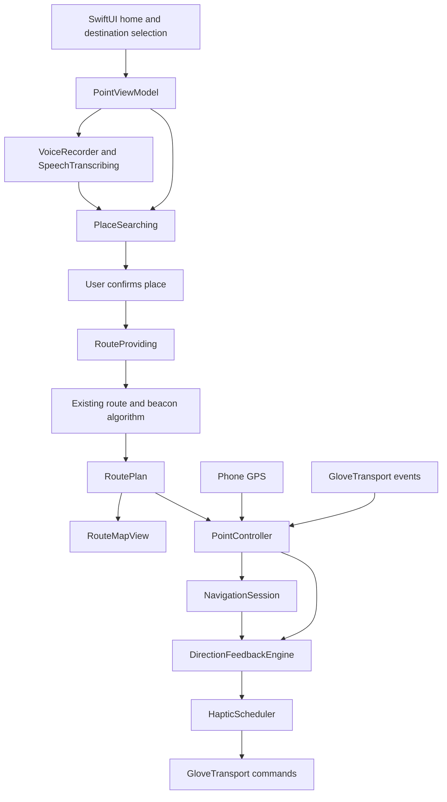

# Point — project plan and team handoff

Updated: September 19, 2026 — calibrated glove integration. This document separates code that exists today from integration work and future design work.

Glove update: the app and ESP32-S3 now share the raw quaternion/motor protocol. Two-pose setup learns the finger vector; live map, outdoor direction feedback and indoor test-beacon vibrations use the glove. Automatic cues require the finger within ±30° of level. Phone-as-glove controls are removed; camera floor placement, route progress and MBTA transit remain. See [setup steps](DEVICE_SETUP.md) and the current integration record at the end of this document.

September 20, build 20: outdoor north correction now survives temporary phone GPS/compass interruptions and BLE reconnection. A valid correction is cached in memory for up to 30 minutes within 2 km, retaining the better reference when newer readings are noisier. Live glove freshness, sensor health, directional uncertainty, and route GPS checks remain enforced. The 178 core tests include simulated dropout, rotation, noisy updates, travel outside the local area, expiry and reconnect coverage; physical navigation accuracy still needs a walking trial.

September 20, build 22: live phone diagnostics confirmed a valid north offset was being rejected by adding the phone's magnetic-azimuth error to glove uncertainty. Correction capture now requires a stable cluster of paired true-minus-magnetic values and uses a separate provisional 5° allowance plus observed spread. Missing north and excessive direction uncertainty have different messages. Debug builds retain a local latest-value diagnostic snapshot. Glove compass readiness and route GPS gates remain independent.

September 20, build 25: outdoor vibration now follows estimated pointing within 25° for 200 ms and stops beyond 35°. This is the default, with no extra mode. Previously the app added heading and GPS bearing uncertainty to the pointing angle, making confirmation impossible for the recorded 17° glove estimate and nearby beacons. Combined uncertainty is now diagnostic only, including when a beacon is inside the GPS uncertainty circle; pointing tolerates GPS gaps up to 15 seconds using the last accepted location, while beacon advancement still requires fixes no more than 5 seconds old. Glove health and the raised-hand gate still apply. Debug snapshots include angle error, uncertainty, active beacon distance/index, queued commands, acknowledgements and transport errors.

Voice update: the live Apple Speech/OpenAI input flow now has Deepgram Flux spoken replies, with native speech fallback. `.env.example` documents Debug-only configuration. Speech stops on recording, cancel, inactivity and interruption; VoiceOver owns announcements when enabled. See [voice setup](VOICE_SETUP.md). City clarification, route confirmation and follow-up corrections are implemented; unrestricted conversation remains out of scope.

Maps update: map display, destination search, and walking directions now use native Apple MapKit. The Google SDK and key requirements have been removed. Typed destination search needs no API credentials. The microphone now records and transcribes through OpenAI in Debug builds; the scripted demo runs only with the `--preview-route` launch argument.

Bluetooth update: Point S3 implements echo verification, capability negotiation, BNO055 quaternion/health replies and finite DRV2605L pulses. The matching firmware has passed Mac BLE checks; iPhone-to-glove physical trials remain pending. Legacy C6 firmware still verifies echo only.

## 1. Product and agreed scope

Point is a camera-free walking-navigation app paired with a pointing glove. The user says where they want to go, confirms the destination, and points their hand toward the next geographic route beacon. A short vibration confirms correct pointing.

The app is for anyone, with an intended focus on people with visual impairments. Voice input, accessible controls, understandable connection states, and nonvisual feedback matter more than a dense dashboard. The prototype is not yet validated as an independent mobility aid.

Decisions already made:

- Native Swift and SwiftUI on iPhone, with a reusable Swift navigation core.
- Phone GPS supplies position; the glove supplies its own pointing orientation over Bluetooth Low Energy.
- We are using the existing algorithm for route geometry, checkpoints, and geographic beacons. The surrounding app, map presentation, voice flow, session control, and glove feedback are being built around it.
- Vibration means the glove is pointing toward the active beacon. It does not encode left/right turns, walking direction, or obstacle clearance.
- No camera is required for walking navigation or glove hardware. An optional ARKit test screen uses the camera to place nearby temporary beacons and the calibrated glove for guidance.
- Keep the home screen minimal: wordmark, short prompt, hand, microphone, typing alternative, and preview.
- Hardware selection and assembly belong to the hardware team. The app communicates through a replaceable transport interface.

Earlier brainstorming covered rehabilitation, learned gestures, a belt attachment, cycling, and multiple sponsor integrations. The agreed implementation is the navigation glove described here. Those other ideas are not current app features.

## 2. What partners can run today

The default app records real speech, with live Apple Speech text and optional OpenAI final transcription. Typing works without provider keys. For the staged animation demo, launch with `--preview-route`:

1. The selected sketch hand pinches and pulls in a native transcript banner.
2. “Take me to Shake Shack” appears word by word.
3. A short loading state represents route preparation.
4. A circular map reveal expands from the voice control.
5. A synthetic Cambridge route appears with a destination panel.
6. “Try the walk” exposes a simulated pointing toggle. This previews UI and phone haptics; it is not glove telemetry.

The staged preview makes no transcription, place-search, or routing requests. Map tiles and an optional spoken sample-route announcement can still require a network connection. The sample route and store location are synthetic and must not be presented as verified walking directions.

Separately, `swift run point-demo` drives the real feedback engine with simulated location and heading samples and prints the resulting motor commands.

## 3. Implementation inventory

| Area | Present in the repository | Remaining work |
| --- | --- | --- |
| Home UI | Minimal dark SwiftUI screen; selected sketch hand; embedded microphone with an invisible native hit target; keyboard alternative | Validate small screens, VoiceOver, larger accessibility text, and physical-device playback |
| Background | Recognizable monochrome map, 2-point blur, drifting silver and muted gold light, soft sheen | Physical-device performance/battery review |
| Motion | Transparent hand-pull movie, native banner/transcript, loading glyph, eased map portal; Reduce Motion support | Physical-device decoder, power and timing checks |
| Voice capture | Permission handling, short M4A recording, finish/cancel, three-second observed silence, 60-second limit, temporary-file cleanup | Live account/device test; interruption and recovery validation |
| Transcription | Injectable OpenAI transcription client | Verify configured model and account access; implement authenticated backend for distribution |
| Spoken replies | Deepgram Flux TTS, native speech fallback, VoiceOver announcements, cancellation and audio interruption handling | Field-test spoken disambiguation, interruptions and timed captions; authenticated backend |
| Place search | Native Apple Maps text search with a nearby region, up to five candidates, explicit destination selection | Live service and simulator happy path verified; physical-iPhone and permission/no-results/error checks remain |
| Route fetch | Native Apple Maps walking directions; decoded steps feed the existing algorithm | Live service and simulator route display verified; outdoor comparison and service failure tests remain |
| Transit | Automatic offer (walks over ~10 min ask "T or walk?" by voice) and transit/walk phrases; `TransitPlanner` (MBTA patterns + Apple walks, transfers at rapid-transit stations, ≤ 4 MBTA calls); `JourneyCoordinator` (board-stop beacon, no beacons while riding, direction/branch-aware arrival buzz, tentative auto-boarding, vehicle tracking, alight cue, transfer, signal-loss hold, replan); journey sheet, leg list, map ride lines; `vehicleArrived` haptic | On-phone verification at real stations; tune 40 m stop radius and underground rules; elevator-closure rerouting; commuter rail/ferry |
| Route processing | Polyline decoding, checkpoint resampling, original-corner preservation, turn-beacon extraction | Broader geometry fixtures and field validation |
| Map | Apple Maps for live routes and previews; route line, active beacon highlight, user location and framing | Wire automatic rerouting and validate outdoor advancement |
| Navigation session | Start/pause/resume/stop, location quality checks, beacon advancement, arrival, off-route detection | Complete UI wiring and outdoor tuning |
| Pointing feedback | True-north bearing comparison, uncertainty margin, dwell, hysteresis, stale-data rejection | Real sensor calibration and physical motor tuning |
| Glove setup | Down/up gravity poses, two-pose mounting check and forward-only vibration gate | Worn-glove pose accuracy and physical vibration verification |
| Nearby beacons | Camera placement, local AR direction, ordered 35 cm arrival, clear/pause and tracking-loss suppression | Physical iPhone tracking/arrival tests; measure drift and tune thresholds |
| Glove interface | Capability-gated FirmwareGlove transport, proposed v1 packet codec, real-route injection, finite motor test and foreground watchdog; legacy echo fallback and simulator | Firmware adoption on ESP32-S3, north-reference calibration, physical board validation, background BLE |
| Tests | Offline route, MapKit adapter, feedback, voice and echo-protocol tests; opt-in live MapKit test | Live BLE checks, service mocks, UI lifecycle and outdoor tests |
| Distribution | Shared Xcode project and reproducible package manifest | Signing/team selection, backend, release configuration, background behavior |

“Implemented” means code exists and can be built or exercised locally; it does not mean the complete live hardware flow has been tested.

## 4. Target user journey

### Destination entry

Tap the hand to raise the talk panel, then hold the panel while speaking and let go to send (push to talk), so a pause mid-sentence never cuts the request short. With VoiceOver the button is tap-to-start, tap-to-finish, and a pause also finishes. Apple Speech shows the words live while recording; OpenAI (when configured) supplies the final transcript. Normalize phrases such as “take me to” and “nearest,” search nearby places, and let `DestinationResolver` route directly when the request is unambiguous or ask the user otherwise. Typing remains available for the same search flow. All permissions (microphone, speech, location, Bluetooth) are requested at first launch.

The microphone records real audio. Apple Speech provides live text and a fallback final transcript; OpenAI optionally refines the final transcript. The scripted demo is reachable through `--preview-route`. Typed search uses real Apple Maps without credentials. Deepgram Flux speaks short app-authored replies, with native speech fallback and VoiceOver announcements. OpenAI interprets constrained navigation follow-ups; route checks remain map-driven. General-purpose chat is not implemented.

### Route review

Reveal the map from the voice control, keep the complete route above the bottom panel, and show one clear Start walking action. Distinguish sample routes from live routes. Preserve map-provider attribution.

### Walking and pointing

GPS updates advance the active beacon. Incoming glove heading samples are compared with the bearing from the phone's position to that beacon. After stable alignment, send a short confirmation pulse. Stop confirmation when pointing is lost or the input data becomes unreliable.

Surface disconnected, calibration-needed, uncertain location, reroute-needed, paused, and arrived states without relying on color alone. The core supports several of these states, but the current app does not yet expose all of them.

### Public transportation

When the user accepts the transit offer (or asks for the T/bus outright) the destination becomes a `JourneyPlan`: walk → ride → walk with any number of rides. Each walking leg is an ordinary `RoutePlan` whose final beacon is relabelled `boardStop` (or `destination`). `JourneyCoordinator` runs one walking session per leg above the unchanged `PointController`, treats 40 m from the board station (or GPS fading out after being near it) as "reached", stops the controller so there are no beacons or pointing while waiting and riding, and polls MBTA predictions filtered by route, direction and acceptable branch patterns. A vehicle `STOPPED_AT`/`INCOMING_AT` one of the board platforms sends the `vehicleArrived` haptic once per trip and boarding station (three short pulses on current S3 firmware). Departure of that vehicle is tentative boarding until confirmed; the boarded trip is tracked by trip id, and its arrival at an alight platform cues "get off". Transfers inside a station go straight to waiting. After alighting underground the next walking leg starts silent (`awaitingSignal`) until a fresh, accurate fix arrives. Lost live data, lost tracking, a wrong-direction ride and a missed stop are all surfaced, the last two as a replan. See [the transit design](TRANSIT_MODE_PLAN.md).

### Cancel and lifecycle

Cancel recording/search/demo work without allowing stale asynchronous results to reopen a route. Stopping a journey clears navigation state and feedback. The shell cancels recording or the staged demo when inactive and stops glove output. Started walks continue GPS progress using background location; backgrounding closes BLE, so reconnect and repeat pointing setup on return. Local AR tests clear their beacons on inactivity. Manual pause, end and arrival disable background location. Physical locked-screen behavior and background glove integration still need testing/work.

## 5. Architecture and file ownership boundaries

| Path | Responsibility |
| --- | --- |
| `App/PointHomeView.swift` | Home, transcript/loading states, background atmosphere, map reveal, route panel, destination/typing sheets |
| `App/GloveOutline.swift` | Selected sketch asset, flat wrist crop, and native microphone hit target |
| `App/HandVoiceInteraction.swift`, `App/HandMotionPlayer.swift` | Native transcript banner and transparent hand-video playback |
| `App/PointTheme.swift` | Brand and surface colors |
| `App/DeviceConnection.swift`, `App/DeviceSetupView.swift` | BLE echo-service discovery, setup, verification, and recovery UI |
| `Sources/PointCore/Device/BTTestProtocol.swift` | Firmware UUIDs, byte limits, and exact round-trip validation |
| `App/PointViewModel.swift` | App flow, demo, live service calls, GPS delegate, app-to-core composition |
| `App/RouteMapView.swift` | Native Apple Maps route renderer |
| `Sources/PointCore/Navigation/` | Existing route algorithm and new navigation lifecycle |
| `Sources/PointCore/Guidance/DirectionFeedback.swift` | Pointing confidence and alignment rules |
| `Sources/PointCore/Device/GloveTransport.swift` | Hardware boundary, simulation, haptic command scheduling |
| `Sources/PointCore/PointController.swift` | Session, transport, feedback, and guarded rerouting coordination |
| `Sources/PointCore/ServiceClients.swift` | OpenAI transcription HTTP client |
| `Sources/PointCore/AppleMapsService.swift` | Native place search, walking directions and MapKit-to-route adapter |
| `Sources/PointCore/VoiceDestination.swift` | Voice/search protocols, candidate model, query normalization, standalone voice flow |
| `Sources/PointCore/VoiceRecorder.swift` | iOS audio recording |
| `Tests/PointCoreTests/` | Fast route, feedback, and voice checks |

The app currently orchestrates the search sequence in `PointViewModel`; `VoiceDestination` also contains a separately tested flow. Consolidating this duplication is useful follow-up work, not a completed refactor.

Long-route update: route drawing is cached per route, heading display is isolated and throttled to 10 Hz, walking marker count is bounded to 13 without discarding route beacons, and segmentation runs off the UI thread. Haptics evaluate only the active target. A 361-beacon traversal regression and marker bounds up to 10,000 beacons pass; desktop timings and device-test limits are recorded in [phone beacon tests](PHONE_BEACON_TEST.md#long-routes-and-performance).

## 6. Existing algorithm and current tuning

### Route construction

Read decoded MapKit step polylines, merge adjacent step boundaries, preserve original vertices, and insert checkpoints approximately every 15 meters. Each checkpoint carries its coordinate, cumulative distance, step instruction, and outgoing bearing. Extract the start, turns of at least 45 degrees, and destination as sparse geographic beacons.

MapKit coordinates enter the shared segmenter directly. `LegacyDirectionsImporter` remains for offline fixtures and compatibility only. A beacon is a geographic target, not a physical Bluetooth beacon.

The agreed product behavior is guidance toward important turns/bends and the destination, not a beacon every 15 metres. Internal 15-metre checkpoint insertion is still in the code; removing it has not been part of this provider migration. The current 45-degree local-turn rule can miss gradual curves. Improve and field-test that selection before claiming the glove follows every curved path.

### Progress and rerouting

- Accept navigation fixes no more than 5 seconds old with horizontal accuracy no worse than 25 meters.
- Ignore duplicate or older fixes.
- Advance at a beacon only after two distinct qualifying fixes within 8 meters, each with accuracy no worse than 8 meters.
- Flag an off-route condition after three fixes farther from the path than `max(25 meters, 2 × GPS accuracy)`.
- Route replacement resets progress, and the controller prevents a late reroute result from reviving a stopped or replaced journey.
- Automatic reroute triggering and its UI are not yet wired into the app shell.

### Pointing and vibration

The algorithm computes the signed difference between the target bearing and glove heading, accounting for north wraparound. Measured pointing error controls alignment. Combined heading and position-derived angular uncertainty is recorded for diagnostics, without blocking feedback toward the estimated beacon. A beacon must be more than 3 metres from the estimated position to have a usable direction. This confirms an estimated direction, not a guarantee that the true direction lies inside the entry cone. Individual location and heading validity checks remain enforced.

| Parameter | Current value |
| --- | --- |
| Required heading frame | True north |
| Maximum retained GPS age for pointing | 15 seconds |
| Maximum heading age | 0.5 seconds |
| Maximum heading uncertainty | 25 degrees |
| Combined heading and position angular uncertainty | Diagnostic only |
| Enter alignment | Measured angular error at most 25 degrees |
| Leave alignment | Measured angular error above 35 degrees |
| Stable alignment dwell | 200 ms |
| Confirmation pulse | 180 ms; intensity value 160 on the app's UInt8 scale |
| Minimum interval between pulses | 900 ms |
| Foreground watchdog expectation | Approximately 10 Hz, plus incoming sensor/location events |

These are prototype glove defaults, not calibrated hardware specifications. The real-glove foreground watchdog now evaluates at 10 Hz; physical stale-sensor behavior still needs board testing. Indoor glove guidance uses a 20 Hz room loop and eased finite motor pulses; phone stand-in controls are removed. The mounted finger must stay within ±30° of level for automatic haptics. Firmware must end every finite pulse locally even if the phone disconnects or suspends.

## 7. Hardware integration plan

The current circuit uses XIAO ESP32-S3, primary BNO055 fused orientation with magnetometer, redundant MPU6050, and DRV2605L. Firmware update `e83f936` is merged. The IMUs share GPIO2/1 at 100 kHz; haptics uses GPIO41/42 at 400 kHz. BNO055 is sampled at 50 Hz, MPU6050 at 100 Hz. The teammate reports the combined Arduino circuit verified; ESP-IDF/S3 BLE integration and app mounting setup are implemented; physical calibration trials, magnetic-interference trials and automatic sensor failover remain unfinished. The C6 echo project is a legacy reference. Charging/protection, motor electrical ratings, battery and gesture hardware remain hardware-team decisions.

The preferred form is electronics on the back of the hand and battery near the wrist, avoiding the palm and fingertips where practical. A belt attachment and learned gestures are future exploration.

Before app/firmware integration, agree on:

1. BLE service and characteristic UUIDs; notification/write direction; packet version and encoding.
2. Heading units, axis mapping, mounting offset, handedness, calibration status, and conversion to true north.
3. Sample frequency, timestamp/age semantics, sequence numbering, and stale/out-of-order packet handling.
4. Connection readiness and capability negotiation; do not treat discovery as ready.
5. Finite pulse duration/intensity encoding, stop behavior, queue limits, and reconnect reset.
6. Gesture events and debounce; raw gesture learning is outside the first integration.
7. Battery reporting and recoverable error states.

The app now connects CoreBluetooth through `FirmwareGlove`, a tested `GloveTransport`, and selects it for real glove mode. The simulator remains available for explicitly labeled sample routes. Live routes and indoor test beacons use the glove; phone stand-in controls are removed. The [proposed S3 packet contract](FIRMWARE_APP_PROTOCOL.md) defines capability negotiation, bounded commands, sample-age checks and acknowledgements; the S3 firmware implements it and physical validation remains pending. The primary BNO055 now supplies fused magnetic heading; the app supports calibration/health-gated readings and paired-phone-heading declination correction. Mounted pointing-axis and physical accuracy validation remain needed. MPU6050 fallback stays relative-only. See [the hardware contract](HARDWARE_INTERFACE.md).

## 8. Visual direction and hand integration

The selected sketch hand and embedded microphone are integrated. A transparent HEVC clip opens a native SwiftUI transcript banner; the hand exits and the transcript remains. The map background keeps its monochrome streets, soft blur, moving silver/gold light and sheen. The loading state and circular map reveal remain.

The app retains native controls, cancellation, a still-image fallback, and a simpler transition for Reduce Motion and accessibility text sizes. Physical-device playback, battery use, VoiceOver and large-text coverage still need validation. See [the hand interaction plan](HAND_VOICE_INTERACTION_PLAN.md) for asset paths, timing, completed implementation and remaining device checks.

## 9. Suggested parallel workstreams

Owners below are roles to claim, not assignments to named teammates.

| Workstream | First deliverable | Completion evidence |
| --- | --- | --- |
| Hardware/firmware | Actual board/sensor inventory and agreed BLE contract | Fresh calibrated heading notifications and finite pulse/stop commands on the bench |
| iOS BLE | `GloveTransport` implementation and dependency injection | Connect, disconnect, reconnect, stale packets, calibration state, and battery exercised with the board |
| Voice/services | Validated live destination flow and backend design | Real utterance → transcript → selected place → walking route on an iPhone |
| Navigation integration | Session state bound to map and controls; watchdog and reroute wiring | Active beacon advances visibly; arrival, pause, errors, and stop behave correctly |
| Design/accessibility | Approved hand asset, accessible microphone, transcript-focused interaction | Visual approval plus VoiceOver, larger text, Reduce Motion, and contrast checks |
| Integration/demo | Repeatable bench and supervised walking scenario | Recorded test results distinguishing simulation from live hardware |

Use separate branches and pull requests. Coordinate before editing `PointViewModel.swift`, `PointHomeView.swift`, or the transport contract because those are the main shared integration points.

## 10. Milestones and acceptance criteria

### M0 — Shared development baseline

- Publish the current app, core, shared Xcode project, documentation, and tests.
- Every teammate can clone, run `swift test`, run `swift run point-demo`, and launch the simulator preview without credentials.
- Keep personal Xcode settings, credentials, generated artwork studies, and build output out of source control.

### M1 — Live destination services

- First test typed Apple Maps search with location permission and internet access; no maps credentials are required. Configure the OpenAI Debug credential locally (scheme environment variable or the Documents `dev.env` file) for microphone testing.
- Verify the transcription model with the actual account; the current client default is `gpt-transcribe` and has not been validated against a funded account.
- Exercise microphone denial, absent/stale GPS, empty results, network failure, cancellation, and a valid route.
- Improve the first-location flow: it currently requests access and asks the user to retry once a usable fix arrives.
- `DestinationResolver` auto-selects when the request is unambiguous (nearest match for a chain/generic name; Apple's top result for a qualified request) and shows the chooser otherwise. Verify both paths and the Change destination recovery on a phone.

### M2 — Glove bench integration

- Agree on the wire contract and implement transport plus firmware.
- Demonstrate heading calibration, alignment dwell, pulse limiting, stop on misalignment, and stop on disconnect.
- Add the foreground watchdog and test stale heading/GPS without new events.
- Tune physical feedback with the actual motor and mounting orientation.

### M3 — Complete walking session

- Feed session snapshots into the map, highlight the active target, and update after reroutes.
- Display pause, arrival, reroute-needed, and real device status.
- Connect off-route detection to guarded route requests with appropriate retry behavior.
- Test short supervised walks, nearby turns, GPS uncertainty, stopping mid-request, and reconnects.
- Validate the new background GPS route tracking on a locked phone. Glove feedback remains foreground-only; background BLE integration is still pending.

### M4 — Presentation and release readiness

- Validate the integrated sketch hand and transcript-pulling animation on physical iPhones.
- Validate interaction timing and accessibility on physical devices.
- Move the OpenAI transcription secret behind an authenticated voice backend before distribution, with server-side limits and error handling.
- Prepare a demo that labels simulated states and identifies which provider/hardware integrations are actually working.

## 11. Sponsor and demo context

Earlier conversations explored hardware sponsors and voice/AI challenges. Keep the project coherent: choose hardware based on the actual glove, use OpenAI for destination conversation, and Deepgram for transcription and spoken replies. Sensor-history analytics, rehabilitation coaching, and additional sponsor APIs are not implemented or committed requirements.

Do not assume earlier challenge/prize discussion establishes eligibility. Before submitting, a teammate should check the current organizer requirements against the hardware and APIs actually used. Preserve a concise record of development work and a working demonstration rather than claiming planned integrations.

## 12. Validation baseline and known gaps

The Apple Maps adapter has regression coverage for native step geometry, turn instructions, empty/one-point steps, full-route fallback, sparse beacons on straight paths, and invalid geometry/requests. Existing route, feedback, voice and Bluetooth echo tests remain. The optional live MapKit test uses public Cambridge landmark coordinates, not device GPS.

Migration verification on September 19, 2026:

- **Passed:** 19 offline tests; the separate opt-in live MapKit test also passed (20 tests total).
- **Passed:** unsigned iPhone build and iPhone simulator build, without a Google package dependency. Phone installation still uses each developer's signing configuration.
- **Passed:** live MapKit search for MIT Museum and a walking route from public Cambridge coordinates; the service returned 69 checkpoints and 7 beacons in that test.
- **Passed:** simulator keyboard entry → Apple Maps destination/address selection → real walking route display, using a simulated Cambridge location and no provider keys.
- **Observed limitation:** granting location permission on the first search returns a retry message; search works after a fresh fix and retry. A single simulator location fix can become stale, so refresh the simulated location when testing later actions.
- **Resolved:** all iPad interface orientations are now declared; the current build no longer has that warning.
- **Not verified:** the complete live voice flow, iPhone-to-board BLE, physical motor feedback, outdoor navigation, accessibility coverage, or locked-screen behavior.

Run the network test explicitly with `POINT_TEST_LIVE_MAPS=1 swift test --filter AppleMapsTests.liveAppleSearchAndWalkingRoute`. The ordinary `swift test` run skips this one network test.

## Remaining work, prioritized

| Priority / owner | Required work | Done when |
| --- | --- | --- |
| P0 — iOS / live input | Exercise typed search and route selection on an iPhone, then configure and test real OpenAI transcription | A real typed destination and a real utterance each produce a deliberately selected Apple walking route; cancellation and denied permissions recover cleanly |
| P0 — hardware / BLE | Complete iPhone-to-S3 end-to-end trials of the implemented echo/quaternion/motor contract | The phone receives the exact probe reply; power loss, reconnect, missing replies and Bluetooth denial are verified |
| P0 — firmware + iOS | Validate the implemented two-pose mounting setup and forward-only automatic haptics on the worn glove | Calibrated true-north heading drives finite physical motor pulses; misalignment, stale data and disconnect stop them |
| P1 — indoor testing | Validate AR placement, room alignment and glove feedback on-device | Forward pointing strengthens feedback; a lowered hand is silent; local arrival, tracking loss and interruption behavior are observed |
| P1 — transit | Ride a Red Line + Green Line trip and a Route 1 bus trip with the app; background it mid-ride | Board-stop beacon, arrival buzz for the right direction only, automatic boarding/alighting with overrides, transfer, signal-loss hold and replan all behave; MBTA calls per plan ≤ 6 |
| P1 — navigation | Validate glove-backed active-beacon, pause/resume, arrival and uncertainty UI | UI reflects core changes and cannot continue displaying a replaced route or stale connection |
| P1 — navigation | Validate the implemented foreground 10 Hz watchdog and connect off-route detection to guarded Apple rerouting | Stale sensors stop feedback without new packets; reroutes reset progress; late requests cannot reopen a stopped journey |
| P1 — algorithm | Remove optional fixed-distance sampling if no longer useful; handle gradual bends and closely spaced turns | Geometry tests and supervised walks show that sparse targets follow the actual path without cutting corners |
| P1 — app / hardware | Outdoor accuracy and calibration trials | Recorded results cover turns, arrival, poor GPS, magnetic interference and mounting orientation; thresholds are tuned from evidence |
| P2 — voice / backend | Add authenticated, rate-limited OpenAI proxy and validate the configured transcription model | Release voice works without embedding provider credentials; errors and limits are handled |
| P2 — lifecycle | Implement and validate microphone interruptions and intended background/locked-phone behavior | Phone calls, lock/unlock, app switching and reconnection leave truthful session/feedback state |
| P2 — design / accessibility | Test hand playback, VoiceOver, larger text, Reduce Motion, contrast and battery use on phones | Findings are documented and blocking issues are fixed |

Not implemented: obstacle detection, learned gestures and independent-mobility validation. Destination conversation now supports clarification, corrections and route confirmation. Camera input exists only for temporary local test beacons; live Apple Speech text and synthesized spoken replies have separate voice implementations. These do not establish validated glove navigation.

## Current glove integration — September 19, 2026

- Restored the previous task's uncommitted work into the continuation checkout without losing transit or indoor floor placement.
- Implemented both sides of opcode-5 signed WXYZ quaternion protocol and strict HELLO `0x1F` dependencies. Firmware reads coherent orientation; Swift normalizes, validates health, and includes BLE round-trip latency in sample age.
- Added two-pose mounting setup with live calibration levels, stable sample windows, opposing down/up gravity poses, measured repeatability, session reset and manual remount reset. No arbitrary mount-valid flag or claimed 2° hardware accuracy.
- Removed the phone tester/player/status controls. The live map arrow and outdoor navigation use accepted glove heading; phone readings supply GPS and local declination only; pointing setup uses glove-only down/up gravity poses.
- Added the user's forward-pointing requirement: automatic cues require the calibrated finger within ±30° of horizontal. Vertical/up/down poses and stale data stop automatic output. Explicit motor-test buttons intentionally work independently.
- Preserved MBTA trip planning/boarding/alighting and camera floor placement. Indoor guidance now uses glove magnetic pointing, explicit room alignment toward beacon 1, and finite eased glove pulses. Camera position continues to determine beacon arrival even with a lowered hand.
- S3 firmware built, flashed with verified write hashes, and passed Mac BLE echo/HELLO/ATTITUDE/ORIENTATION checks. Ten orientation samples had norm² about 1.0000 and ages 6–26 ms. Three finite motor requests were acknowledged; STOP and clean disconnect completed. Sensor calibration was 0/3/0/0, so this is not a successful physical pointing calibration.
- Firmware host protocol/motor tests pass with ASAN/UBSAN. Swift checks cover calibration, wraparound, wrist roll, invalid/opposing poses, hand-down/vertical muting, stale samples, protocol corruption and room transforms alongside transit/AR regression tests. A timing-sensitive transit polling test now waits for its observed state with a bounded deadline instead of assuming a 60 ms scheduling window.
- Pending physical evidence: worn-glove two-pose setup and rotated-wrist accuracy, actual motor sensation, lowered-hand cutoff timing, iPhone-to-glove navigation, indoor tracking recovery, and supervised outdoor/transit trials. Motor requests and builds do not establish these.

See [setup](DEVICE_SETUP.md), [wire contract](FIRMWARE_APP_PROTOCOL.md), and [firmware bench record](../Firmware/S3Firmware/README.md). Background BLE, persistent calibration, hardware motor cutoff, battery telemetry and automatic IMU failover remain out of scope for this bring-up.

Final verification: 121 Swift tests in 26 suites pass; S3 ASAN/UBSAN host tests, signed iPhone build and iOS simulator build pass. Device setup was visually checked in the simulator. The matching app was installed on the connected iPhone and launched with Device setup. This does not establish iPhone-to-glove physical calibration or vibration.

Setup simplification: removed mandatory six-face accelerometer calibration and all-levels=3 readiness. The app now accepts system >0, gyro=3 and magnetometer ≥2, matching Bosch guidance on optional accelerometer calibration and usable compass level 2. Two-pose mounting validation, age/health checks and the ±30° haptic gate are unchanged. Firmware packets and motor behavior are unchanged.

Glove-only setup update: removed the phone compass/motion reference and its setup text and motion permission. Capture finger-down then finger-up from glove quaternions; reject unstable, stale, same-pose or inconsistent captures. This verifies mounting repeatability, not absolute magnetic accuracy. The prototype uses a documented provisional 5° compass allowance plus measured pose spread and disagreement. No phone vibration player or controls remain in the app.

Screenshot regression fixed: System 0 / Gyro 3 / Accel 3 / Compass 1 now permits down/up mounting capture. Gravity-pose setup and magnetic navigation use separate readiness checks. Compass settling no longer disables capture or erases the learned finger axis, while automatic compass guidance remains paused until north is acquired. A magnetic-reference loss invalidates indoor room alignment independently. Removed six-side wording and the stale “hold both” instruction. Regression tests reproduce the screenshot levels and cover compass acquisition/loss plus stale/gyro-fault rejection.

### Route-start voice confirmation — build 19

Prepared walking and transit routes now ask “Would you like to start? Say yes or no.” One reply window follows completed speech; explicit approval starts the prepared route, while refusal, silence, interruption and capture failures leave it ready. The route remains visible, hold-to-speak is preserved for destination entry, and button/voice starts invalidate stale replies. Validation covers reply parsing, simulated yes/no transcripts through the app, the accessible start/wait controls, 170 core tests, and a signed iPhone build. Physical speech recognition and listening conditions still need an on-device trial.
