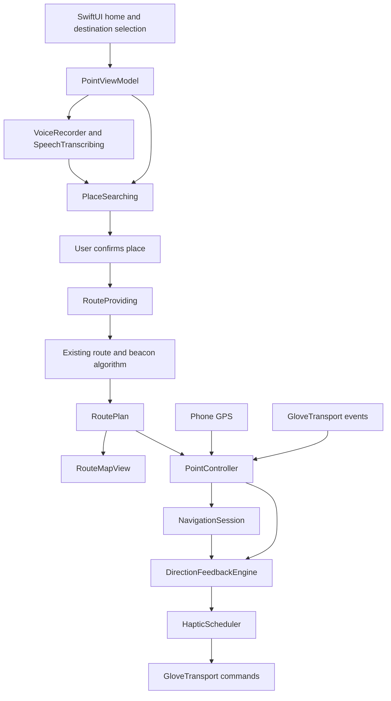

# Point — project plan and team handoff

Baseline: September 19, 2026. This document separates code that exists today from integration work and future design work.

Bluetooth update: the merged ESP32-C6 echo firmware now has a matching iOS device setup flow. Users can scan, connect, and verify a unique command/status round trip. This remains separate from navigation capabilities, which the firmware does not yet implement. See [device setup](DEVICE_SETUP.md) for the bench test; live board verification is pending.

## 1. Product and agreed scope

Point is a camera-free walking-navigation app paired with a pointing glove. The user says where they want to go, confirms the destination, and points their hand toward the next geographic route beacon. A short vibration confirms correct pointing.

The app is for anyone, with an intended focus on people with visual impairments. Voice input, accessible controls, understandable connection states, and nonvisual feedback matter more than a dense dashboard. The prototype is not yet validated as an independent mobility aid.

Decisions already made:

- Native Swift and SwiftUI on iPhone, with a reusable Swift navigation core.
- Phone GPS supplies position; the glove supplies its own pointing orientation over Bluetooth Low Energy.
- We are using the existing algorithm for route geometry, checkpoints, and geographic beacons. The surrounding app, map presentation, voice flow, session control, and glove feedback are being built around it.
- Vibration means the glove is pointing toward the active beacon. It does not encode left/right turns, walking direction, or obstacle clearance.
- No camera, computer vision, or palm/fingertip camera hardware.
- Keep the home screen minimal: wordmark, short prompt, hand, microphone, typing alternative, and preview.
- Hardware selection and assembly belong to the hardware team. The app communicates through a replaceable transport interface.

Earlier brainstorming covered rehabilitation, learned gestures, a belt attachment, cycling, and multiple sponsor integrations. The agreed implementation is the navigation glove described here. Those other ideas are not current app features.

## 2. What partners can run today

The default app runs without provider credentials or glove hardware. Tap the white microphone in the hand or tap Preview:

1. A simulated recording state shows a waveform.
2. “Take me to Shake Shack” appears word by word.
3. A short loading state represents route preparation.
4. A circular map reveal expands from the voice control.
5. A synthetic Cambridge route appears with a destination panel.
6. “Try the walk” exposes a simulated pointing toggle. This previews UI and phone haptics; it is not glove telemetry.

The default preview makes no transcription, place-search, or routing requests. Map tiles can still require a network connection. The sample route and store location are synthetic and must not be presented as verified walking directions.

Separately, `swift run point-demo` drives the real feedback engine with simulated location and heading samples and prints the resulting motor commands.

## 3. Implementation inventory

| Area | Present in the repository | Remaining work |
| --- | --- | --- |
| Home UI | Minimal dark SwiftUI screen; native hand outline; white microphone with an invisible 56-point hit target; keyboard alternative | Finish and approve sketch artwork; validate small screens and larger accessibility text |
| Background | Recognizable monochrome map, 2-point blur, drifting silver and muted gold light, soft sheen | Physical-device performance/battery review |
| Motion | Waveform, staged transcript, loading glyph, eased map portal; Reduce Motion support | Proposed hand-pulls-transcript animation, after still artwork approval |
| Voice capture | Permission handling, short M4A recording, finish/cancel, 20-second limit, temporary-file cleanup | Live account/device test; interruption and recovery validation |
| Transcription | Injectable OpenAI transcription client | Verify configured model and account access; implement authenticated backend for distribution |
| Place search | Google Places text search with location bias, up to five candidates, explicit destination selection | Live request validation; permission/no-results/error UX refinement |
| Route fetch | Google walking Routes client and normalization into the existing algorithm | Live route comparison and service failure tests |
| Route processing | Polyline decoding, checkpoint resampling, original-corner preservation, turn-beacon extraction | Broader geometry fixtures and field validation |
| Map | Google renderer when configured; Apple preview fallback; route line, markers, route framing and controls | Bind active beacon, updated route, rerouting, and arrival to live session state |
| Navigation session | Start/pause/resume/stop, location quality checks, beacon advancement, arrival, off-route detection | Complete UI wiring and outdoor tuning |
| Pointing feedback | True-north bearing comparison, uncertainty margin, dwell, hysteresis, stale-data rejection | Real sensor calibration and physical motor tuning |
| Glove interface | Navigation transport protocol and simulator; separate CoreBluetooth setup for the ESP32-C6 echo service | Physical board validation; sensor/haptic wire format and navigation adapter |
| Tests | 16 tests across route, feedback, voice, and echo-protocol suites | Live BLE checks, service mocks, UI lifecycle and outdoor tests |
| Distribution | Shared Xcode project and reproducible package manifest | Signing/team selection, backend, release configuration, background behavior |

“Implemented” means code exists and can be built or exercised locally; it does not mean the complete live hardware flow has been tested.

## 4. Target user journey

### Destination entry

Tap the microphone, speak a destination, and tap again to finish. Transcribe the recording, normalize phrases such as “take me to,” and search nearby places. Let the user choose a named place and address before fetching directions. Typing remains available for the same search flow.

The simulated interaction remains the default until live services are configured. The current transcript animation is visual simulation, not streaming speech recognition or generated spoken audio. A conversational LLM, TTS service, and multi-turn dialogue are not implemented.

### Route review

Reveal the map from the voice control, keep the complete route above the bottom panel, and show one clear Start walking action. Distinguish sample routes from live routes. Preserve map-provider attribution.

### Walking and pointing

GPS updates advance the active beacon. Incoming glove heading samples are compared with the bearing from the phone's position to that beacon. After stable alignment, send a short confirmation pulse. Stop confirmation when pointing is lost or the input data becomes unreliable.

Surface disconnected, calibration-needed, uncertain location, reroute-needed, paused, and arrived states without relying on color alone. The core supports several of these states, but the current app does not yet expose all of them.

### Cancel and lifecycle

Cancel recording/search/demo work without allowing stale asynchronous results to reopen a route. Stopping a journey clears navigation state and feedback. The current shell cancels recording or the staged demo when inactive; full active-journey background behavior still needs implementation and testing.

## 5. Architecture and file ownership boundaries

| Path | Responsibility |
| --- | --- |
| `App/PointHomeView.swift` | Home, transcript/loading states, background atmosphere, map reveal, route panel, destination/typing sheets |
| `App/GloveOutline.swift` | Current native hand placeholder; replacement point for approved artwork |
| `App/PointTheme.swift` | Brand and surface colors |
| `App/DeviceConnection.swift`, `App/DeviceSetupView.swift` | BLE echo-service discovery, setup, verification, and recovery UI |
| `Sources/PointCore/Device/BTTestProtocol.swift` | Firmware UUIDs, byte limits, and exact round-trip validation |
| `App/PointViewModel.swift` | App flow, demo, live service calls, GPS delegate, app-to-core composition |
| `App/RouteMapView.swift` | Google Maps bridge and Apple preview renderer |
| `Sources/PointCore/Navigation/` | Existing route algorithm and new navigation lifecycle |
| `Sources/PointCore/Guidance/DirectionFeedback.swift` | Pointing confidence and alignment rules |
| `Sources/PointCore/Device/GloveTransport.swift` | Hardware boundary, simulation, haptic command scheduling |
| `Sources/PointCore/PointController.swift` | Session, transport, feedback, and guarded rerouting coordination |
| `Sources/PointCore/ServiceClients.swift` | Transcription, Places, and Routes HTTP clients |
| `Sources/PointCore/VoiceDestination.swift` | Voice/search protocols, candidate model, query normalization, standalone voice flow |
| `Sources/PointCore/VoiceRecorder.swift` | iOS audio recording |
| `Tests/PointCoreTests/` | Fast route, feedback, and voice checks |

The app currently orchestrates the search sequence in `PointViewModel`; `VoiceDestination` also contains a separately tested flow. Consolidating this duplication is useful follow-up work, not a completed refactor.

## 6. Existing algorithm and current tuning

### Route construction

Decode step polylines, merge adjacent step boundaries, preserve original vertices, and insert checkpoints approximately every 15 meters. Each checkpoint carries its coordinate, cumulative distance, step instruction, and outgoing bearing. Extract the start, turns of at least 45 degrees, and destination as sparse geographic beacons.

The Google Routes response is normalized into the input shape accepted by this algorithm. `LegacyDirectionsImporter` is the internal adapter name; it does not mean the app is calling an older Directions endpoint. A beacon is a geographic target, not a physical Bluetooth beacon.

### Progress and rerouting

- Accept navigation fixes no more than 5 seconds old with horizontal accuracy no worse than 25 meters.
- Ignore duplicate or older fixes.
- Advance at a beacon only after two distinct qualifying fixes within 8 meters, each with accuracy no worse than 8 meters.
- Flag an off-route condition after three fixes farther from the path than `max(25 meters, 2 × GPS accuracy)`.
- Route replacement resets progress, and the controller prevents a late reroute result from reviving a stopped or replaced journey.
- Automatic reroute triggering and its UI are not yet wired into the app shell.

### Pointing and vibration

The algorithm computes the signed difference between the target bearing and glove heading, accounting for north wraparound. It adds heading uncertainty and position-derived angular uncertainty before deciding alignment.

| Parameter | Current value |
| --- | --- |
| Required heading frame | True north |
| Maximum heading age | 0.5 seconds |
| Maximum heading uncertainty | 25 degrees |
| Enter alignment | Conservative angular error at most 15 degrees |
| Leave alignment | Conservative angular error above 25 degrees |
| Stable alignment dwell | 350 ms |
| Confirmation pulse | 180 ms; intensity value 160 on the app's UInt8 scale |
| Minimum interval between pulses | 900 ms |
| Foreground watchdog expectation | Approximately 10 Hz, plus incoming sensor/location events |

These are prototype defaults, not calibrated hardware specifications. The app shell still needs to schedule the watchdog; event-only evaluation cannot reliably expire stale data when all incoming events stop. Firmware must end every finite pulse locally even if the phone disconnects or suspends.

## 7. Hardware integration plan

The merged connection firmware now targets the XIAO ESP32-C6. The earlier hardware shortlist from team brainstorming included a compact XIAO ESP32-S3, BNO055/BNO085-class orientation sensor, coin/ERM motor with a DRV2605L driver, and finger flex or capacitive gesture sensors. Charging/protection modules, battery placement, antenna needs, and fallback indicators remain hardware-team decisions. Availability, exact board dimensions, power requirements, and sensor performance are not confirmed by this repository.

The preferred form is electronics on the back of the hand and battery near the wrist, avoiding the palm and fingertips where practical. A belt attachment and learned gestures are future exploration.

Before app/firmware integration, agree on:

1. BLE service and characteristic UUIDs; notification/write direction; packet version and encoding.
2. Heading units, axis mapping, mounting offset, handedness, calibration status, and conversion to true north.
3. Sample frequency, timestamp/age semantics, sequence numbering, and stale/out-of-order packet handling.
4. Connection readiness and capability negotiation; do not treat discovery as ready.
5. Finite pulse duration/intensity encoding, stop behavior, queue limits, and reconnect reset.
6. Gesture events and debounce; raw gesture learning is outside the first integration.
7. Battery reporting and recoverable error states.

Implement a new CoreBluetooth class conforming to `GloveTransport`, and inject it at the app composition boundary. Keep `SimulatedGlove` available for independent app development. See [the hardware contract](HARDWARE_INTERFACE.md).

## 8. Visual direction and pending hand work

The current app uses a native white hand outline over a lightly blurred map with moving silver/gold light. The microphone is now white with no visible circle; its invisible tap area remains 56 × 56 points. The map remains identifiable beneath the atmospheric movement. Background motion pauses when hidden/inactive and becomes static with Reduce Motion.

The other design task is refining a simple white sketch hand: natural proportions, fine varied linework, an open unfilled palm, and minimal interior detail. Generated stills are studies and are not yet the app's hand asset. Keep the native microphone separate from any illustration.

The proposed later animation makes the transcript the focus: the hand pulls words from the left across the screen and exits while the transcript remains. The user requested still-hand approval before creating that video/animation. Do not treat it as completed or replace the current working reveal prematurely.

## 9. Suggested parallel workstreams

Owners below are roles to claim, not assignments to named teammates.

| Workstream | First deliverable | Completion evidence |
| --- | --- | --- |
| Hardware/firmware | Actual board/sensor inventory and agreed BLE contract | Fresh calibrated heading notifications and finite pulse/stop commands on the bench |
| iOS BLE | `GloveTransport` implementation and dependency injection | Connect, disconnect, reconnect, stale packets, calibration state, and battery exercised with the board |
| Voice/services | Validated live destination flow and backend design | Real utterance → transcript → selected place → walking route on an iPhone |
| Navigation integration | Session state bound to map and controls; watchdog and reroute wiring | Active beacon advances visibly; arrival, pause, errors, and stop behave correctly |
| Design/accessibility | Approved hand asset, accessible microphone, transcript-focused interaction | Visual approval plus VoiceOver, larger text, Reduce Motion, and contrast checks |
| Integration/demo | Repeatable bench and supervised walking scenario | Recorded test results distinguishing simulation from live hardware |

Use separate branches and pull requests. Coordinate before editing `PointViewModel.swift`, `PointHomeView.swift`, or the transport contract because those are the main shared integration points.

## 10. Milestones and acceptance criteria

### M0 — Shared development baseline

- Publish the current app, core, shared Xcode project, lockfile, documentation, and tests.
- Every teammate can clone, run `swift test`, run `point-demo`, and launch the simulator preview without credentials.
- Keep personal Xcode settings, credentials, generated artwork studies, and build output out of source control.

### M1 — Live destination services

- Configure Debug credentials locally and explicitly enable live voice.
- Verify the transcription model with the actual account; the current client default is `gpt-transcribe` and has not been validated against a funded account.
- Exercise microphone denial, absent/stale GPS, empty results, network failure, cancellation, and a valid route.
- Improve the first-location flow: it currently requests access and asks the user to retry once a usable fix arrives.
- Keep selection explicit; never navigate automatically to the first search result.

### M2 — Glove bench integration

- Agree on the wire contract and implement transport plus firmware.
- Demonstrate heading calibration, alignment dwell, pulse limiting, stop on misalignment, and stop on disconnect.
- Add the foreground watchdog and test stale heading/GPS without new events.
- Tune physical feedback with the actual motor and mounting orientation.

### M3 — Complete walking session

- Feed session snapshots into the map, highlight the active target, and update after reroutes.
- Display pause, arrival, reroute-needed, and real device status.
- Connect off-route detection to guarded route requests with appropriate retry behavior.
- Test short supervised walks, nearby turns, GPS uncertainty, stopping mid-request, and reconnects.
- Decide background/locked-phone behavior explicitly; the current prototype does not implement reliable background navigation.

### M4 — Presentation and release readiness

- Approve and integrate the sketch hand; then implement the requested transcript-pulling animation.
- Validate interaction timing and accessibility on physical devices.
- Move provider secrets behind an authenticated backend before distribution, with server-side limits and error handling.
- Prepare a demo that labels simulated states and identifies which provider/hardware integrations are actually working.

## 11. Sponsor and demo context

Earlier conversations explored hardware sponsors and voice/AI challenges. Keep the project coherent: choose hardware based on the actual glove, and use OpenAI for the intended voice-to-destination experience. Other voice vendors, sensor-history analytics, rehabilitation coaching, and additional sponsor APIs are not implemented or committed requirements.

Do not assume earlier challenge/prize discussion establishes eligibility. Before submitting, a teammate should check the current organizer requirements against the hardware and APIs actually used. Preserve a concise record of development work and a working demonstration rather than claiming planned integrations.

## 12. Validation baseline and known gaps

At initial handoff, the existing 11 core tests passed locally. The Bluetooth setup update adds five passing protocol tests, for 16 total. They cover malformed polyline handling, turn preservation, Routes normalization, duplicate/inaccurate location rejection, route replacement, north wraparound/dwell, stale or uncalibrated heading, haptic limiting/stop, disconnect recovery, destination normalization/selection, and empty typed input.

The iOS simulator build and the home/route screens have also been checked. These checks do not establish physical-device BLE behavior, live provider account access, outdoor navigation accuracy, complete accessibility coverage, or locked-screen reliability.

Next integration work should prioritize actual sensor data, live services, state propagation, and lifecycle handling. Do not mistake the polished simulated interaction for a completed hardware navigation product.
